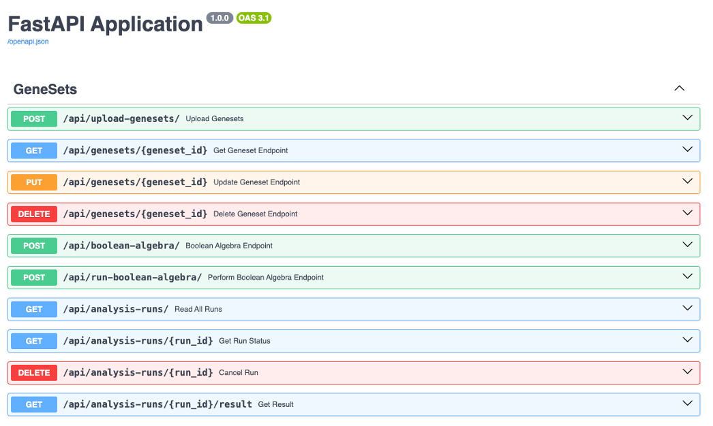
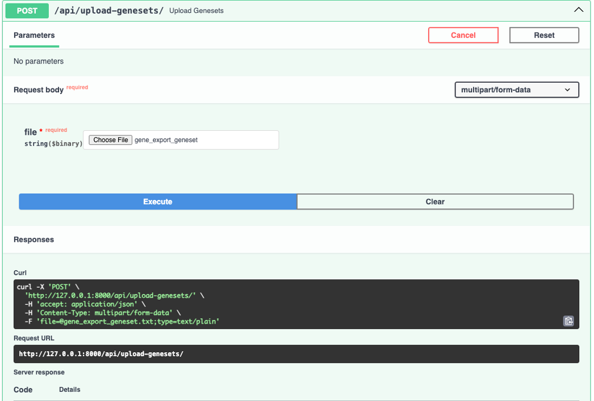
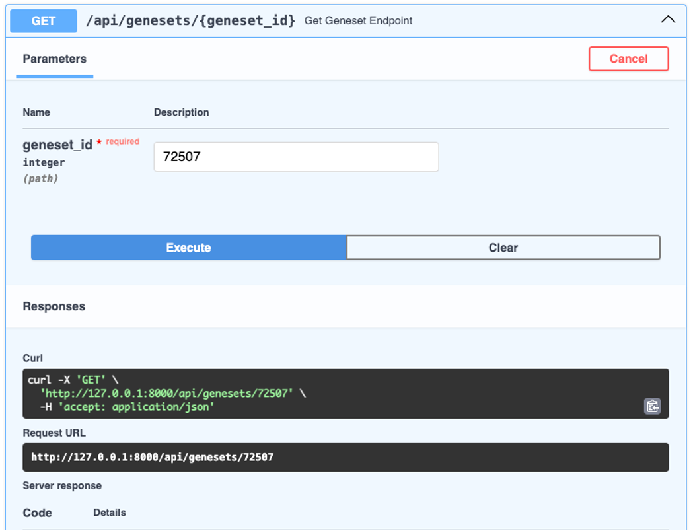
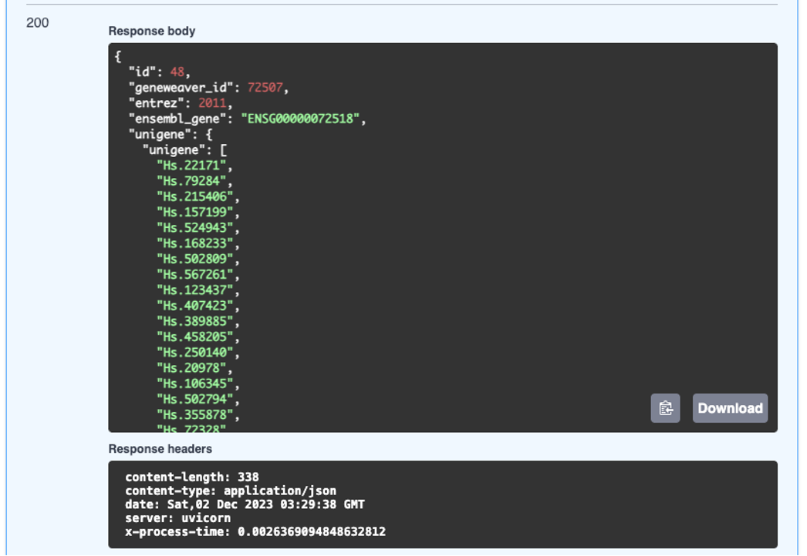
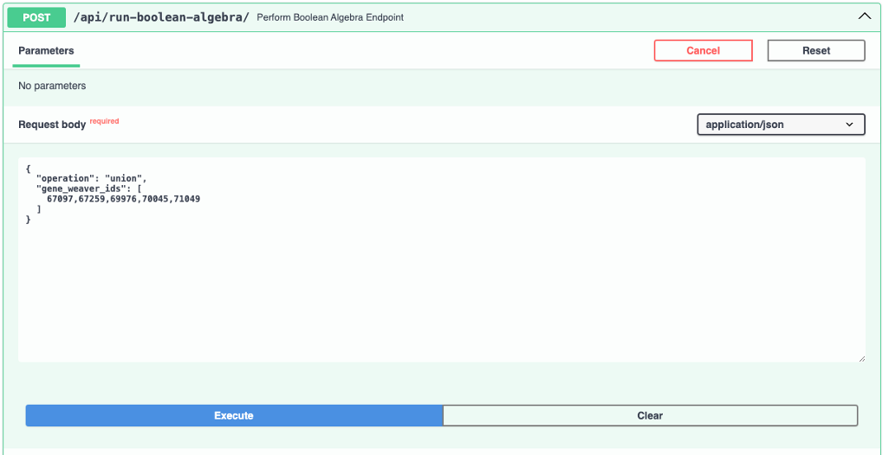
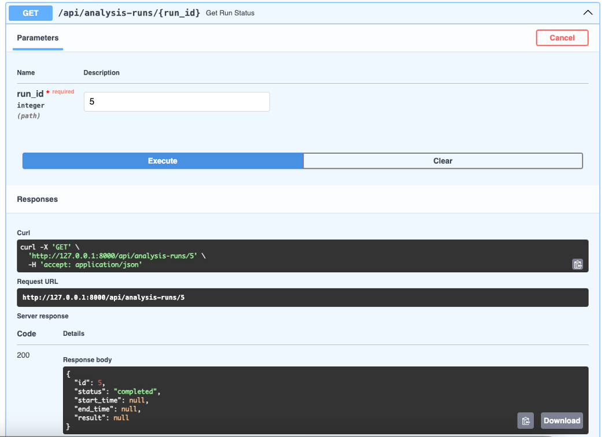
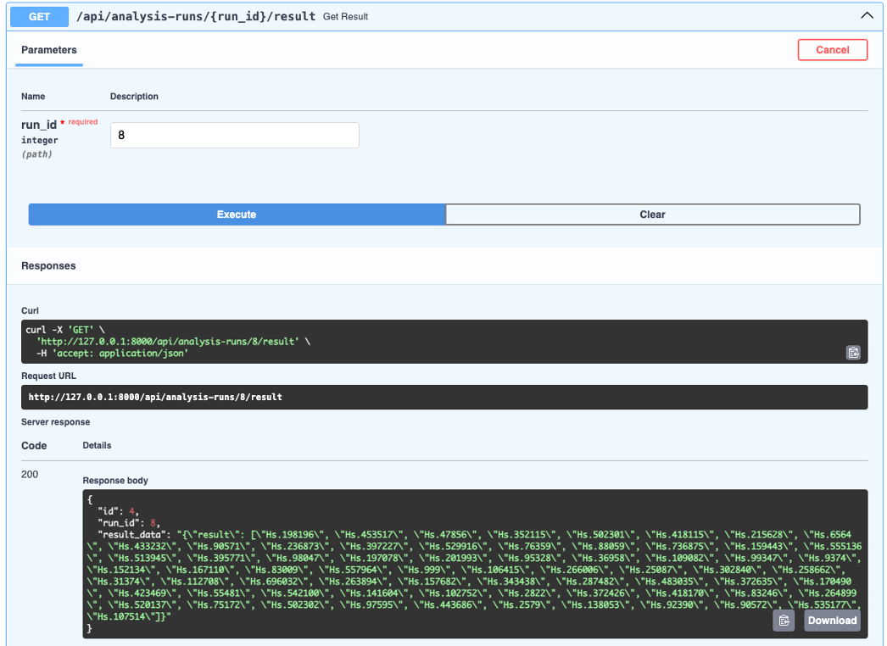

# geneweaver_api2
Course Project: GeneWeaver via the Jackson Laboratory

Team Proposal - COMPLETED BY 10/23: 
https://docs.google.com/document/d/17qEHeylFt6ThuapZygZXUNvLmzfzNjj2rC1PpV2iTvk/edit?usp=sharing

Software Requirements Specification - COMPLETED BY 11/05: 
https://docs.google.com/document/d/1FQkVkiSTnoVr9IiR0PhKYnk9hczZ19wCiuEXsvgONV4/edit?usp=sharing

Team contract - COMPLETED BY 10/04/2023: 
https://docs.google.com/document/d/1nqIGKddytdJBRqTARRtW3JbWNPb4gNyA7POc9tDYoJM/edit?usp=sharing

Team journal - UPDATED BY 10/05/2023: 
https://docs.google.com/document/d/1BageM1DAPPq-mbU1CmQ3jFVcC6lWLO0EUnSNBtY9xOI/edit?usp=sharing

Team Organization and Process Model Selection - COMPLETED BY 10/22/2023: 
https://docs.google.com/document/d/1jNBsGh9B5vaEgp9MgfxTOLZ2PymoVEgEvToO7adcIAE/edit?usp=sharing

Software Design Documentation - COMPLETED BY 11/13/2023: 
https://docs.google.com/document/d/1WdLCj7MD1JzKI8Ehyf17oXpsJt1j9FNiS3Uky8RF9VE/edit?usp=sharing

# Work below are individual contribution
UML diagram:

To use this version of FastAPI application, follow this workflow:
1. Activate the virtual environment: source FastAPI/myenv/bin/activate
2. Navigate to the FastAPI folder: cd FastAPI
3. Run the app: uvicorn run:app --reload 
4. Access the swaggerUI URL: http://127.0.0.1:8000/docs
5. a .db file will be created automatically after running the app
6. Open the .db in the SQLite database to view the tables

Data Parsing:
Upload gene_export_geneset.txt (in the Sampledataset folder) use the uploaddataset API endpoints to test the functions
To perform Boolean Algebra analysis on the uploaded dataset using the Boolean Algebra tool:
1.	Reading the file, extracting the relevant columns (Geneweaver_id, and Unigene), and converting the Unigene column into sets of geneset.
Unigene is a database maintained by the National Center for Biotechnology Information for experimental research, which provides a set of non-redundant sequences of genes or expressed sequence tages(ESTs)
The Unigene column in the dataset contains a list of identifiers, separated by the pip character "|", which would be split into individual genes to create a set.
Each identifier in the Unigene column represents a unique cluster of gene expression or sequence data.
Each ID corresponds to a particular set of gene expression or sequence data that is considered unique within the database. 
Data are grouped based on sequence similarity, which implies that they may represent the same gene or similar genes.
Researchers and bioinformaticians use these identifiers to access data, perform comparative analyses, and study the functions and relationships of genes across different species.

2.	Converting the set datatype to json to be stored in the SQLite database.
3.	Boolean Algebra analysis will be performed on the Unigene column data, as the set of genes for each GeneWeaver ID.
4.	Prepare "BooleanAlgebraInput" instances for each Boolean algebra operation will be performed.
    This will include specifying the operation type (Union, intersection, difference) and providing the list of gene sets to process.
5.	Running the analysis: instance the Boolean algebra tool, perform the analysis, and return the result.

Database:
We are creating three tables that are stored in the database:

Genesets table: store the input dataset in the database.
AnalysisRun table: store the analysis run ID, run status, start time, end time.
The AnalysisResult table is used to store the analysis results for each run.

From Genesets table to AnalysisRun table: 
When a new analysis task is initiated, the application will reference the Genesets table to retrieve the necessary data. 
It will then create a new entry in the AnalysisRun table to track the analysis process. 
The new entry will include a unique run ID and the status will be set to 'pending' or 'running'.

Running the Analysis: 
The analysis task will use the data from the Genesets table to perform the required computations or processing. 
Throughout this task, updates on progress can be recorded in the AnalysisRun table by updating the run status.

Storing Results: 
Once the analysis is complete, the results are stored in the AnalysisResult table. 
Each entry in this table is linked to a specific run ID from the AnalysisRun table, ensuring that results can be traced back to their respective analysis tasks.

End of Run Updates: 
The AnalysisRun table is updated with the 'end time' of the run, and the run status is changed to 'completed'. 
If there were any issues, the status could reflect an 'error' state, and additional error information could be stored if necessary.

Upload local dataset

Get geneset by ID

Perform a single Boolean Algebra Analysis, users will input the analysis tool (union/intersection/difference) and the geneweaver_id

Get analysis run status by Run ID

Get analysis run result by Run ID

# Simultaneuos multithreading-SQLite
Example Geneset Table:

Geneset table will retrieve necessary data from genesets

Example AnalysisRunStatus Table

New entry:
include a unique run ID and the status will be set to 'pending' or 'running'.
Update on the progress recorded by updating the run status
Update end time and status when complete

Example AnalysisRunResult Table

# Simultaneuos multithreading-Initiate analysis task
POST: Create a new entry to track the analysis process when a new analysis task is initiated

