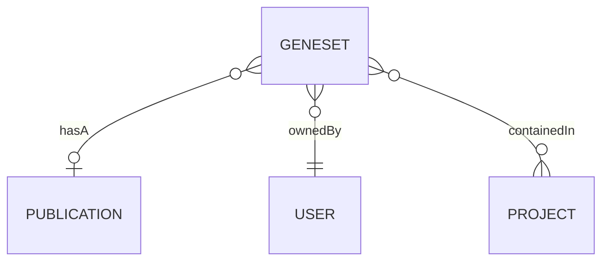
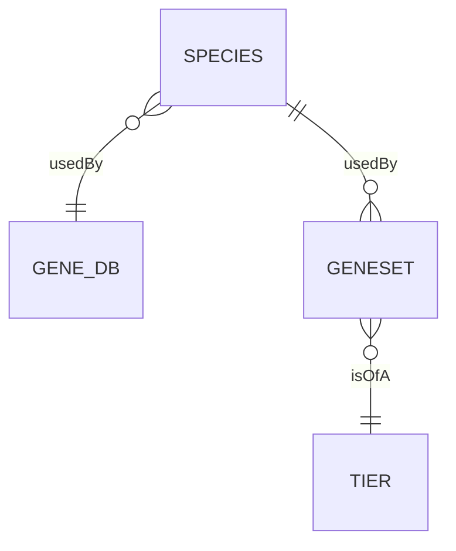
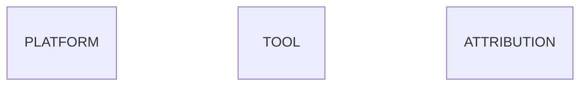
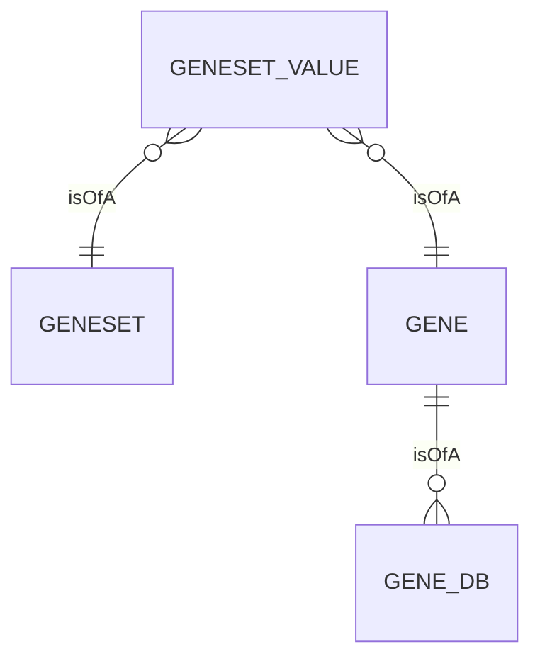

GeneWeaver utilizes a relational normalized data model to store both user data, and
external sources data. The [database](https://en.wikipedia.org/wiki/Database) is 
designed to be flexible and extensible, and to allow for the addition of new data types 
and analysis tools without requiring changes to the data model.
GeneWeaver使用规范化的关系型数据模型来存储用户数据和外部数据源。该数据库的设计灵活且可扩展，可以添加新的数据类型和分析工具，而无需更改数据模型。
从高层次上看，数据模型使用三个schema来组织存储在数据库中的数据类型。这些schema包括：
production：Geneweaver应用数据
odestatic：静态数据
extsrc：外部数据源数据

On a high level the data model uses three 
[schemas](https://en.wikipedia.org/wiki/Database_schema) to organize the types of data
that are stored in the database. The schemas are:

- `production`: Geneweaver Application Data
- `odestatic`: Static Data
- `extsrc`: External Sources Data

This page discusses the concepts and structure of the data model in detail, but is not 
intended to be used as a reference for the database and data model. For example, this 
page does not use the actual database table and column names, but instead uses full 
descriptive name of the entities and their relationships.

!!! tip
    For a complete reference of the Geneweaver data model, see the 
    [data model](/reference/data-model) reference page. 

## Production Schema
Production Schema
production模式是用于存储用户数据的主要模式。该模式的核心实体是geneset 🧬+📂。该模式包含用于用户数据的表和关系，但外部源和静态数据关系使用odestatic和extsrc模式中的表。
The `production` schema is the primary schema used to store user data. The schema's 
central entity is the `geneset` 🧬+📂. The schema contains tables & relationships for
user data, but external source and static data relationships utilize tables in the
`odestatic` and `extsrc` schemas.
production模式是用于存储用户数据的主要模式。该模式的核心实体是geneset 🧬+📂。该模式包含用于用户数据的表和关系，但外部源和静态数据关系使用odestatic和extsrc模式中的表。

## ODEStatic Schema
The `odestatic` schema contains tables for static data, such as species, gene databases,
and geneset tier. The schema is used to store data that is not expected to change, and
is used to provide a reference for the `production` schema.

The following diagram shows how the `geneset` 🧬+📂 entity is related to the `odestatic`
schema entities: `species` and `tier`.

The `odestatic` schema also contains tables that are used for internal tracking
and configuration. Above, the `gene_db` entity for the `platform`, `tool`, and 
`attribution` entities. These entities are used internally by the system to track
information about enabled analysis tools, microarray expression platforms, and data 
sources.
odestatic模式包含静态数据的表，例如物种、基因数据库和基因集层次。该模式用于存储不太可能发生变化的数据，并为production模式提供参考。

## Extsrc Schema
The `extsrc` schema contains tables for external sources data, this is where the 
magic 🪄 happens. 

Fundamentally, the gene 🧬 to geneset 🧬+📂 association is a many-to-many association.
A geneset can contain many genes, and a gene can be associated with many genesets. To 
represent this relationship, the association is stored in an 
[associative table](https://en.wikipedia.org/wiki/Associative_entity), which we call 
`geneset_value`.
extsrc 模式包含用于外部来源数据的表
从根本上讲，基因 🧬 到基因集 🧬+📂 的关联是一对多的关联。一个基因集可以包含多个基因，而一个基因可以与多个基因集关联。为了表示这种关系，我们将关联存储在一个关联表中，我们称之为 geneset_value。
gene 实体是一个多态)实体，可以与多个外部来源关联，这些来源由 gene_db 实体表示。

The `gene` entity is a 
[polymorphic](https://en.wikipedia.org/wiki/Polymorphism_(computer_science)) entity that
can be associated with multiple external sources, which are represented by the `gene_db`
entity.

The following diagram shows how the `geneset` 🧬+📂 entity is related to the `extsrc`
schema entities: `geneset_value`, `gene`, and `gene_db`.

!!! danger "Microarray Expression Data"
    Geneweaver also supports microarray expression data. Due to its complexity, this 
    document does not cover the data model that supports this feature.

    For more information on microarray expression data, see the
    [Data Model](/reference/data-model) reference page.